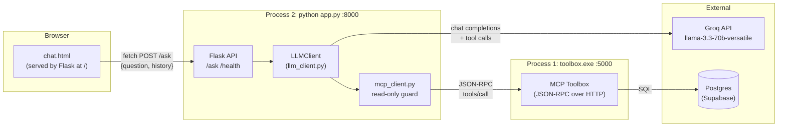
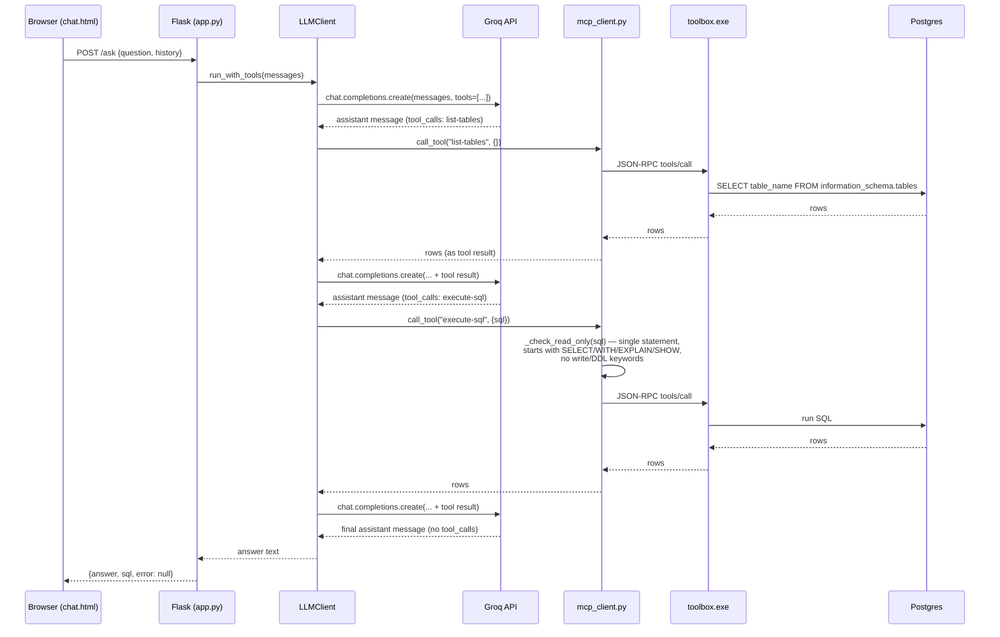

# Ecommerce SQL Agent — Design & Architecture

## 1. Purpose

A natural-language interface to a Postgres (Supabase) e-commerce database. A user
types a question in plain English in a browser chat UI; an LLM (Groq-hosted Llama
3.3 70B) decides which read-only SQL to run to answer it, executes that SQL through
an MCP ("Model Context Protocol") tool server, and returns a natural-language answer
alongside the actual query it ran.

The core design bet: **don't let the model write to the database, and don't trust it
to know the schema** — it must call `list-tables` / `list-relationships` before
guessing at column names, and every `execute-sql` call is re-validated server-side
as read-only regardless of what the model intended.

## 2. System Components

| Component | File(s) | Role |
|---|---|---|
| Chat UI | `chat.html` | Static single-file frontend (vanilla JS, no build step), served by `app.py` |
| API server | `app.py` | Flask HTTP layer; exposes `/`, `/ask` and `/health` |
| Settings | `config.py` | Loads `.env` once and exposes every tunable; imported before anything reads env |
| CLI | `main.py` | Terminal alternative to the web UI, same agent loop |
| LLM client | `llm_client.py` | Wraps Groq's chat-completions API; runs the tool-calling loop |
| MCP client | `mcp_client.py` | JSON-RPC client for the toolbox server; enforces read-only SQL |
| MCP toolbox | `toolbox.exe` + `toolBox/tools.yaml` | Third-party Go binary (`googleapis/genai-toolbox`) that turns declarative YAML tool defs into a running MCP server against Postgres |
| Database | Supabase-hosted Postgres | System of record (not part of this repo) |
| CI | `.github/workflows/ci.yml` | Lint + compile-check on push/PR to `main` |

`toolbox.exe` is a ~280MB prebuilt binary, gitignored — it's a runtime dependency,
not source, and exceeds GitHub's file-size limits.

## 3. Runtime Topology

Three independent OS processes, talking over localhost HTTP:

Nothing is containerized or orchestrated; both processes are started manually
(`toolbox.exe --config=toolBox/tools.yaml --port=5000` — `--config` is a
root-level flag and is *not* accepted after the `serve` subcommand — then
`python app.py` from the project root), and the UI is opened at
<http://127.0.0.1:8000/> — `app.py` serves `chat.html` itself, so the page and
the API share an origin. `main.py` is a third,
alternative entry point that skips Flask and the browser entirely, talking to the
toolbox directly from a terminal REPL.

## 4. Request Flow (`/ask`)

Key mechanics inside `LLMClient.run_with_tools`:

- A fixed system prompt instructs the model to call `list-tables` then
  `describe-table` before querying unfamiliar tables, and to prefer `ILIKE` for
  text filters. `describe-table` is what makes the "don't guess columns" rule
  actionable — `list-tables` alone returns no column information.
- The loop runs up to `max_turns=8` round trips with the model; each round either
  ends in a final text answer or one/more tool calls, which are executed and fed
  back as `role: "tool"` messages. On the final round the tools are withheld
  (`tools=None`), forcing a best-effort answer rather than failing the request.
- Tool-execution errors are caught and returned to the model as
  `{"error": "..."}` rather than raising, so the model can see the failure and
  retry (e.g. fix a bad column name) instead of the whole request failing.
- `app.py`'s `tracking_executor` wraps the real executor purely to remember the
  last `execute-sql` statement, so the API can return it alongside the answer for
  the UI's "query log" panel — the agent itself has no notion of "the SQL to show
  the user."

## 5. The Read-Only Boundary

This is the one hard security control in the system, and it lives entirely in
`mcp_client.py:sanitize_sql` (not in the model, not in the toolbox config):

0. Blank out comments and quoted literals first. Every check below runs against
   this masked copy, so a `;` or a keyword inside `'%delete%'` can't cause a
   false rejection, and a leading `/* ... */` can't hide the opening keyword.
   The original statement is what actually gets executed.
1. Reject if the masked SQL contains more than one `;`-delimited statement.
2. Reject unless the (trimmed, lowercased) statement starts with
   `select`, `with`, `explain`, or `show`.
3. Reject if a write/DDL keyword appears anywhere in the statement — `insert`,
   `update`, `delete`, `drop`, `alter`, `truncate`, `create`, `grant`, `revoke`,
   `copy`, `call`, `merge`, `vacuum`, `replace`, `into`, `refresh`, `lock`,
   `nextval`, `setval`, `dblink`, `pg_sleep`, `pg_read_file`, `pg_ls_dir`,
   `lo_import`, `lo_export` — via a word-boundary regex, which also catches
   data-modifying CTEs like `WITH x AS (INSERT ...)`.
4. Wrap any `SELECT`/`WITH` that carries no `LIMIT` in
   `SELECT * FROM ( ... ) AS _capped LIMIT SQL_MAX_ROWS` (default 500), so no
   single query can push an entire table into the model's context window.

Covered by `tests/test_sql_guard.py`. This runs regardless of what the LLM intends, so a prompt-injected or
hallucinated write statement is blocked before it reaches Postgres. The toolbox
config itself (`toolBox/tools.yaml`) makes no such distinction — `execute-sql` is
declared as a generic `postgres-execute-sql` tool with `destructiveHint: true`;
the read-only enforcement is purely an application-layer decision. Practically,
this means the Postgres role in `DATABASE_URL` still has write privileges — the
guard is a regex allowlist, not a database-level permission boundary.

## 6. Frontend (`chat.html`)

Single static HTML file, no framework, no build step, no bundler:

- Two-pane layout: chat transcript (left) and a "query log" console (right) that
  mirrors, in a terminal-styled panel, the exact SQL the backend ran for each
  answer (or "answered without a database query" when the model didn't need to).
- Polls `GET /health` every 15s and on fetch failure, toggling a connection
  banner and disabling input when the backend is unreachable.
- Conversation history is kept client-side only (`history` array) and replayed
  on each `/ask` call — the backend is fully stateless between requests. The
  server keeps only the last `MAX_HISTORY_MESSAGES` (default 20) of whatever the
  client sends, so token cost per request stays bounded.
- Served from `/` by `app.py`, so `API_BASE` is empty and requests are
  same-origin — no CORS layer and no host to edit.

## 7. Configuration & Secrets

- `.env` (gitignored) holds `DATABASE_URL`, `DB_HOST/PORT/NAME/USER/PASSWORD`,
  and `GROQ_API_KEY`. `config.py` is the only module that calls `load_dotenv()`,
  and every other module reads its settings from there — so no module can read
  `os.getenv` before `.env` has been applied.
- `toolbox.exe` does **not** read `.env` — it only substitutes real process
  environment variables into `toolBox/tools.yaml` (`${DB_PASSWORD}`), so it must
  be launched with `DB_PASSWORD` explicitly exported into the shell.
- Other settings, all env-overridable: `TOOLBOX_URL`
  (`http://127.0.0.1:5000/mcp`), `GROQ_MODEL`, `SQL_MAX_ROWS` (500),
  `MAX_HISTORY_MESSAGES` (20), `PORT` (8000), `FLASK_DEBUG` (off unless `=1`).
- The API still has no auth of its own; it binds to localhost and is intended
  for local/dev use only.

## 8. CI (`.github/workflows/ci.yml`)

Runs on every push/PR to `main`: installs `requirements.txt`, runs `flake8`
restricted to correctness-class checks (`E9,F63,F7,F82` — syntax errors,
undefined names, etc., not style), and byte-compiles the four core Python
modules. It's a fast smoke test, not a test suite — there are currently no
unit/integration tests in the repo.

## 9. Review Notes — Risks & Gaps

- **No authentication** on the Flask API — anyone who can reach port 8000 can
  query the database (through the read-only guard) and burn Groq API quota.
  Fine for local use; would need an auth layer before any shared deployment.
- **DB role has write access**; the only thing preventing writes is app-layer
  regex validation. A least-privilege read-only Postgres role for the toolbox
  connection would remove an entire class of risk (bugs in the regex, or a
  toolbox/library update that changes execution semantics). **This is the
  largest remaining gap** — the guard is defence in depth, not a boundary.
- **No statement timeout** on the database side; a pathological query still ties
  up a connection for the full 30s HTTP timeout and keeps running afterwards.
  Belongs on the Postgres role (`ALTER ROLE ... SET statement_timeout`).
- **`toolbox.exe` version is unpinned/undocumented** in the repo (binary is
  gitignored with no version note or download script), so a fresh clone has no
  way to reproduce the exact toolbox build without being told separately.
- **`TOOLBOX_TOOLS` in `llm_client.py` hand-mirrors `toolBox/tools.yaml`** — the
  two can drift silently. Fetching schemas via the toolbox's `tools/list` would
  remove the duplication.
- **`test-request*.json` / `mcp_req.json`** are ad hoc manual JSON-RPC payloads
  left in the repo root; superseded by `tests/` and safe to delete.
- **Single shared `LLMClient`/Groq client instance** (`app.py:20`) across all
  requests — fine for Groq's stateless client, but worth noting if concurrency
  or per-request config ever matters.

## 10. Suggested Next Steps

1. Point the toolbox at a read-only Postgres role, not the app's main user, and
   set `statement_timeout` on it. (The only item here that regex can't cover.)
2. Pin and document the `toolbox.exe` version.
3. Replace `TOOLBOX_TOOLS` with schemas fetched from the toolbox's `tools/list`.

Done since the first review: debug mode is now env-gated (`FLASK_DEBUG=1`),
`chat.html` is served same-origin from `/` so `API_BASE` and CORS are both gone,
`/ask` logs question + SQL + tracebacks to `agent.log`, and the read-only guard
has a test suite wired into CI.
