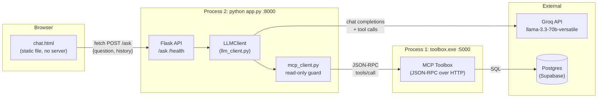
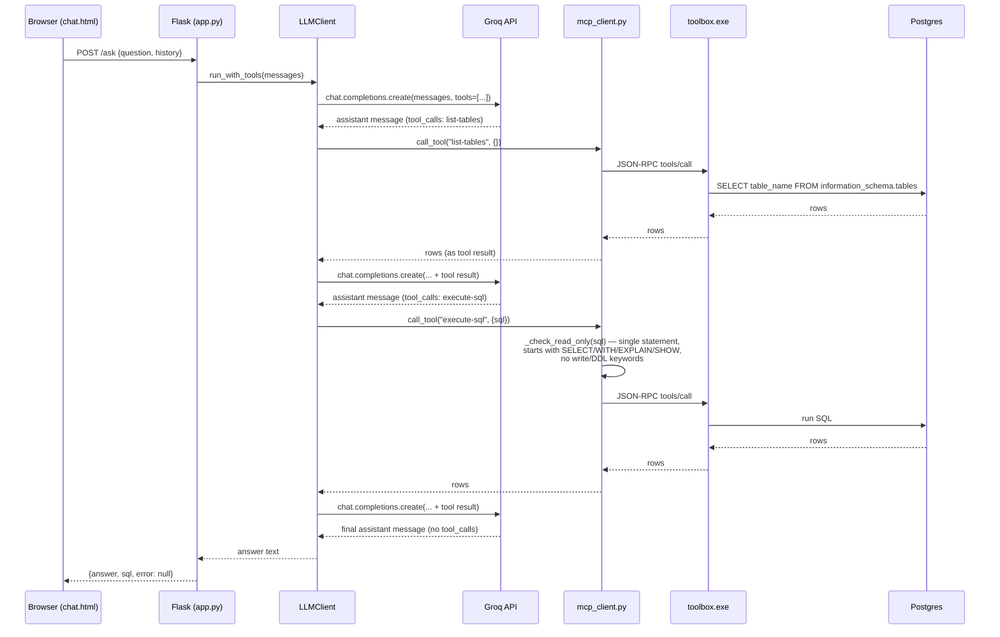
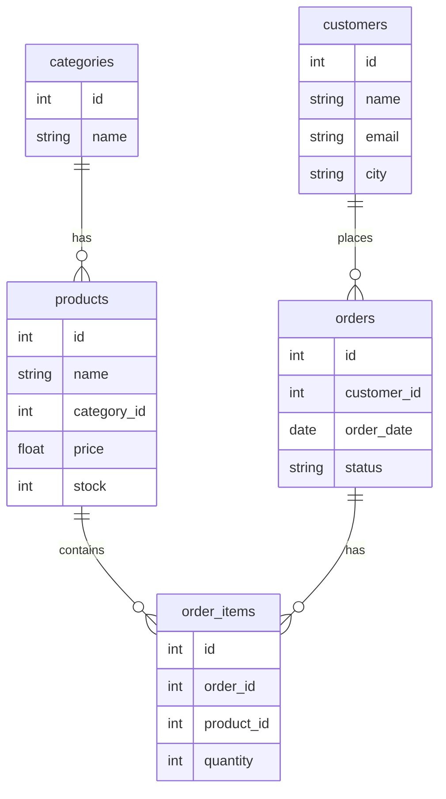

# Ecommerce SQL Agent

A natural-language interface to a Postgres (Supabase) e-commerce database. Ask a
question in plain English through a browser chat UI; an LLM (Groq-hosted
Llama 3.3 70B) decides which read-only SQL to run to answer it, executes that
SQL through an MCP ("Model Context Protocol") tool server, and returns a
natural-language answer alongside the actual query it ran.


## Core Design Bet

**Don't let the model write to the database, and don't trust it to know the
schema.** The agent must call `list-tables` / `list-relationships` before
guessing at column names, and every `execute-sql` call is re-validated
server-side as read-only, regardless of what the model intended.

## Demo


Example questions it can answer:
- "How many customers do we have?"
- "Which product category sells the most?"
- "What is the total revenue from delivered orders?"


## System Components

| Component | File(s) | Role |
|---|---|---|
| Chat UI | `chat.html` | Static single-file frontend (vanilla JS, no build step) |
| API server | `app.py` | Flask HTTP layer; exposes `/ask` and `/health` |
| CLI | `main.py` | Terminal alternative to the web UI, same agent loop |
| LLM client | `llm_client.py` | Wraps Groq's chat-completions API; runs the tool-calling loop |
| MCP client | `mcp_client.py` | JSON-RPC client for the toolbox server; enforces read-only SQL |
| MCP toolbox | `toolbox.exe` + `toolBox/tools.yaml` | Third-party Go binary ([`googleapis/genai-toolbox`](https://github.com/googleapis/genai-toolbox)) that turns declarative YAML tool defs into a running MCP server against Postgres |
| Database | Supabase-hosted Postgres | System of record (not part of this repo) |
| CI | `.github/workflows/ci.yml` | Lint + compile-check on push/PR to `main` |

`toolbox.exe` is a ~280MB prebuilt binary and is **gitignored** — it's a runtime
dependency, not source, and exceeds GitHub's file-size limits. See
[Setup](#setup) below for how to get it.

## Runtime Topology

Three independent OS processes, talking over localhost HTTP:



Nothing is containerized or orchestrated; all three pieces are started manually
(`toolbox.exe serve`, `python app.py`, open `chat.html`). `main.py` is a fourth,
alternative entry point that skips Flask and the browser entirely, talking to
the toolbox directly from a terminal REPL.

## Request Flow (`/ask`)



Key mechanics inside `LLMClient.run_with_tools` (`llm_client.py`):

- A fixed system prompt instructs the model to call `list-tables` /
  `list-relationships` before querying unfamiliar tables, and to prefer `ILIKE`
  for text filters.
- The loop runs up to `max_turns=5` round trips with the model; each round
  either ends in a final text answer or one/more tool calls, which are
  executed and fed back as `role: "tool"` messages.
- Tool-execution errors are caught and returned to the model as
  `{"error": "..."}` rather than raising, so the model can see the failure and
  retry (e.g. fix a bad column name) instead of the whole request failing.
- `app.py`'s `tracking_executor` wraps the real executor purely to remember the
  last `execute-sql` statement, so the API can return it alongside the answer
  for the UI's "query log" panel.

## The Read-Only Boundary

This is the one hard security control in the system, and it lives entirely in
`mcp_client.py:_check_read_only` (not in the model, not in the toolbox config):

1. Reject if the SQL contains more than one `;`-delimited statement.
2. Reject unless the (trimmed, lowercased) statement starts with `select`,
   `with`, `explain`, or `show`.
3. Reject if a write/DDL keyword appears anywhere in the statement —
   `insert`, `update`, `delete`, `drop`, `alter`, `truncate`, `create`,
   `grant`, `revoke`, `copy`, `call`, `merge`, `vacuum`, `replace`, `into` —
   via a word-boundary regex, which also catches data-modifying CTEs like
   `WITH x AS (INSERT ...)`.

This runs regardless of what the LLM intends, so a prompt-injected or
hallucinated write statement is blocked before it reaches Postgres. The
toolbox config itself (`toolBox/tools.yaml`) makes no such distinction —
`execute-sql` is declared as a generic `postgres-execute-sql` tool; the
read-only enforcement is purely an application-layer decision. **This is a
regex allowlist, not a database-level permission boundary** — see
[Known Limitations](#known-limitations).

## Database Schema



## Setup

### Prerequisites
- Python 3.11+
- A Postgres database (this project was built against a free [Supabase](https://supabase.com) instance)
- A free [Groq](https://console.groq.com) API key

### 1. Clone and install dependencies
```bash
git clone https://github.com/fatimazaman981/ecommerce-sql-agent.git
cd ecommerce-sql-agent
pip install -r requirements.txt
```

### 2. Download the MCP Toolbox binary
Download the binary for your OS from the
[genai-toolbox releases page](https://github.com/googleapis/genai-toolbox/releases)
and place it in the project root as `toolbox.exe` (Windows) or `toolbox`
(Mac/Linux).

### 3. Configure environment variables
Create a `.env` file in the project root:
```
DATABASE_URL=postgresql://postgres:<password>@<host>:5432/postgres
DB_HOST=<host>
DB_PORT=5432
DB_NAME=postgres
DB_USER=postgres
DB_PASSWORD=<password>
GROQ_API_KEY=<your_groq_api_key>
```

### 4. Set up the database schema
Run the schema + sample data SQL (see `toolBox/schema.sql` if included, or the
table definitions in the [Database Schema](#database-schema) section above)
against your Postgres instance.

### 5. Start the MCP Toolbox server
```bash
# Windows PowerShell — load .env into the current session first:
Get-Content .env | ForEach-Object {
  if ($_ -match '^\s*([^#][^=]*)=(.*)$') {
    [System.Environment]::SetEnvironmentVariable($matches[1].Trim(), $matches[2].Trim())
  }
}

.\toolbox.exe --config="toolBox/tools.yaml" serve --port=5000
```
Leave this running in its own terminal.

### 6. Run the agent

**Option A — Web UI:**
```bash
python app.py
```
Then open `chat.html` in a browser.

**Option B — CLI:**
```bash
python main.py "How many customers are there?"
```
Or run `python main.py` with no arguments for an interactive prompt.

## Configuration & Secrets

- `.env` (gitignored) holds `DATABASE_URL`, `DB_HOST/PORT/NAME/USER/PASSWORD`,
  and `GROQ_API_KEY`. `llm_client.py` loads it via `python-dotenv`.
- `toolbox.exe` does **not** read `.env` — it only substitutes real process
  environment variables into `toolBox/tools.yaml` (`${DB_PASSWORD}`), so it
  must be launched with `DB_PASSWORD` explicitly exported into the shell (see
  step 5 above).
- `TOOLBOX_URL` (`mcp_client.py`) defaults to `http://127.0.0.1:5000/mcp`,
  overridable via env var.
- CORS is wide open (`CORS(app)`, no origin restriction) since the API has no
  auth of its own — acceptable for local/dev use, not for a public deploy.

## CI

`.github/workflows/ci.yml` runs on every push/PR to `main`: installs
`requirements.txt`, runs `flake8` restricted to correctness-class checks
(`E9,F63,F7,F82` — syntax errors, undefined names, etc., not style), and
byte-compiles the core Python modules. It's a fast smoke test, not a full test
suite.


## Tech Stack

Python · Flask · Groq API (Llama 3.3 70B) · MCP (Model Context Protocol) ·
PostgreSQL · Supabase · HTML/CSS/JS
